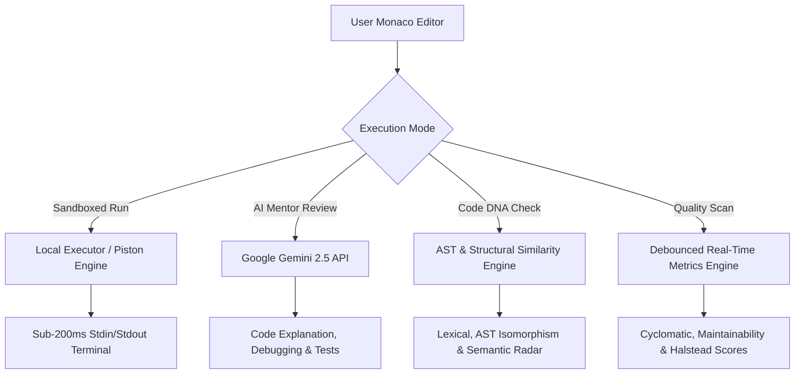
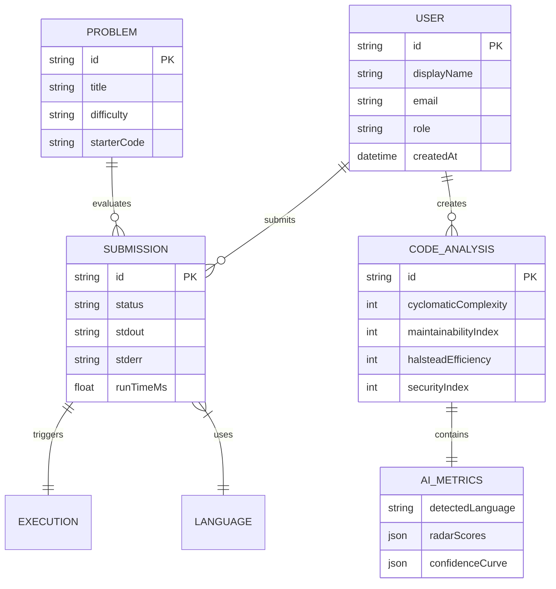

# CodeForge PRO v2.5 — Hackathon Project Presentation

> **Interactive Presentation Deck Artifact**: [`hackathon_presentation.html`](file:///C:/Users/aryan/.gemini/antigravity/brain/e373a138-c7b8-4fef-9214-355b1a0c4fea/hackathon_presentation.html)

---

## 📌 Slide 1: Title & Team Members

### **Project Title**: Multi-Language Compiler & AI Code Intelligence Platform (CodeForge PRO v2.5)
*High-Performance Polyglot Code Execution, Google Gemini 2.5 AI Code Intelligence, AST IR Explorer, & Code DNA Similarity Engine.*

> [!IMPORTANT]
> ### 👥 Hackathon Team Members & Registration Numbers
> 
> | Team Member Name | Registration Number | Project Role |
> | :--- | :---: | :--- |
> | **Akshat Aryan** | `240101120201` | Team Lead & Lead System Architect |
> | **Arun Dev** | `240101120184` | Polyglot Compiler Core Engineer |
> | **Aquib Hussain** | `240101120192` | Security & RBAC Auth Lead |
> | **Warish Khan** | `240101120186` | Frontend UI/UX & Monaco Specialist |
> | **Mohit** | `240101120207` | Gemini AI Pipeline Specialist |
> | **Abhay** | `240101120220` | Telemetry & Performance Engineer |

---

## ⚡ Slide 2: Project Features & Core Working

### **Core Capabilities Breakdown**

1. **Polyglot Execution Engine**:
   - Sandboxed execution supporting JavaScript, TypeScript, Python, C++, Java, and Go.
   - Dual-host runner: Sub-200ms Local CLI execution with isolated process fallback.

2. **Google Gemini 2.5 AI Mentor**:
   - 5 Intelligent Modes: **Explain Logic**, **Generate Unit Tests**, **Debug Stack Traces**, **Code Review**, and **Shortest Code Golf Refactoring**.
   - Automatic API key rotation and model fallback across `gemini-2.5-flash`, `gemini-2.5-pro`, and `gemini-2.0-flash`.

3. **Code DNA & Structural Similarity Comparator**:
   - Calculates 5 similarity metrics: **Lexical**, **Structural Control Flow**, **AST Isomorphism**, **Semantic Match**, and **Algorithmic Match**.

4. **AST Explorer & Compiler IR**:
   - Gemini API AST tree generator displaying hierarchical program structures (`Program`, `FunctionDeclaration`, `BlockStatement`, `WhileStatement`, `IfStatement`).

5. **Real-Time Code Metrics & Quality Radar**:
   - Debounced automatic execution calculating **Cyclomatic Complexity**, **Maintainability Index**, **Halstead Volume**, and **Security Index**.

---

## 📐 Slide 3: System Architecture, ER Diagram & SRS Documentation

### **1. Entity Relationship (ER) Diagram**

### **2. Software Requirements Specification (SRS)**

| Requirement ID | Type | Requirement Title | Technical Specification Detail |
| :---: | :---: | :--- | :--- |
| **FR-01** | Functional | Polyglot Code Execution | Must execute JS, TS, Python, C++, Java, Go in isolated execution environments with custom stdin input support. |
| **FR-02** | Functional | Gemini AI Mentor Pipeline | Must provide bespoke AI analysis for code explanation, test generation, stack trace debugging, and shortest code golf. |
| **FR-03** | Functional | AST & Code DNA Similarity | Must parse source code into hierarchical AST tree nodes and compute 5-axis similarity scores between 2 programs. |
| **FR-04** | Functional | Real-Time Metrics Engine | Must automatically re-evaluate Cyclomatic Complexity, Maintainability, and Halstead volume upon code edits. |
| **NFR-01** | Non-Functional | Execution Latency | Local process execution latency must remain under 200ms; AI metrics debounce set to 600ms. |
| **NFR-02** | Non-Functional | API High Availability | Must gracefully handle Gemini 429 quota limits by rotating API keys and models (`2.5-flash` $\rightarrow$ `2.5-pro`). |
| **NFR-03** | Non-Functional | UI Accessibility | Responsive 3-column animated graphical dashboard adhering to light clay theme standards (`#FAF4EE`, `#2D231E`). |

---

## 🎉 Slide 4: Conclusion & Future Roadmap

### **Summary of Impact**
**CodeForge PRO v2.5** unifies polyglot compilation, AST compiler IR analysis, and Google Gemini AI intelligence into a cohesive, high-performance platform.

> [!TIP]
> ### 🚀 Future Roadmap & Scaling Innovations
> - **Web-Tree-Sitter WASM Grammars**: Browser-side zero-latency AST parsing.
> - **Multi-File Workspace Projects**: Support for multi-module Java/C++ CMake projects.
> - **Automated AI Code Refactoring**: One-click apply for Gemini AI bug fixes and performance optimizations.

---

### 💬 Open for Questions & Demonstration
*Thank you! The presentation deck can be viewed interactively at [`hackathon_presentation.html`](file:///C:/Users/aryan/.gemini/antigravity/brain/e373a138-c7b8-4fef-9214-355b1a0c4fea/hackathon_presentation.html).*
