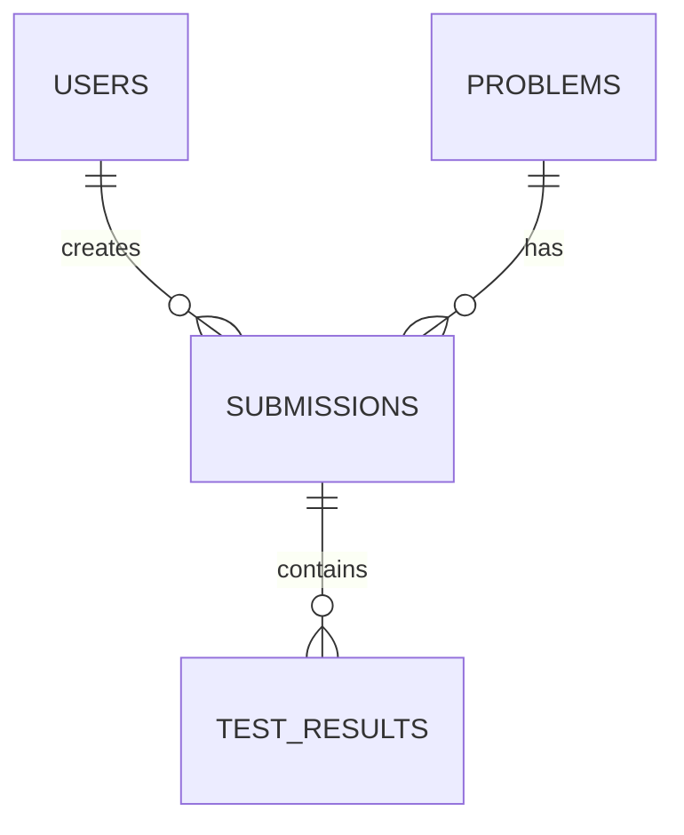

# Database Schema

## Entity Relationship Diagram

## Table Descriptions

### `users`
- `id` (UUID, PK)
- `email` (VARCHAR, Unique)
- `password_hash` (VARCHAR)

### `problems`
- `id` (UUID, PK)
- `title` (VARCHAR)
- `description` (TEXT)
- `test_cases` (JSONB)

### `submissions`
- `id` (UUID, PK)
- `user_id` (UUID, FK)
- `problem_id` (UUID, FK, Nullable)
- `language_id` (VARCHAR)
- `status` (VARCHAR)
- `code` (TEXT)

### `test_results`
- `id` (UUID, PK)
- `submission_id` (UUID, FK)
- `test_case_id` (VARCHAR)
- `passed` (BOOLEAN)
- `execution_time_ms` (INT)
