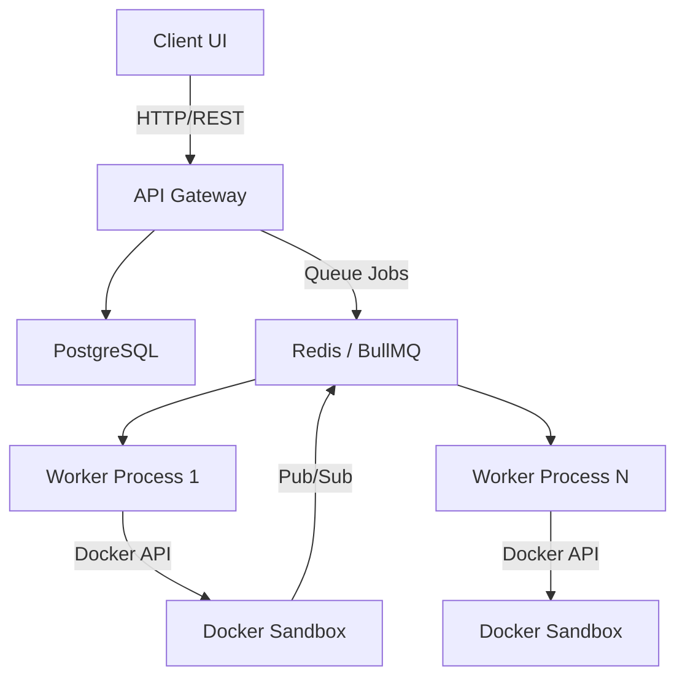

# Multi-Language Code Compiler Platform

A scalable, secure, and robust platform for compiling and evaluating code in multiple programming languages.

## Architecture Overview



## Tech Stack
| Component | Technology |
|---|---|
| Worker Process | Node.js, TypeScript, BullMQ |
| Isolation/Sandbox | Docker, cgroups, dockerode |
| Database | PostgreSQL 16 |
| Cache/Queue | Redis 7 |
| Supported Languages | C, C++, Java, Python, JavaScript, TypeScript, Go, Rust |

## Prerequisites
- Node.js 22+
- Docker & Docker Compose
- PostgreSQL 16+
- Redis 7+

## Quick Start

1. **Clone the repository:**
   ```bash
   git clone <repo-url>
   cd "MULTI LANGUAGE COMPILER"
   ```

2. **Start Infrastructure Services:**
   ```bash
   cd infrastructure/docker
   docker-compose up -d
   ```

3. **Build the Sandbox Image:**
   ```bash
   cd infrastructure/docker/sandbox
   docker build -t code-sandbox:latest .
   ```

4. **Install Worker Dependencies and Run:**
   ```bash
   cd worker
   npm install
   npm run dev
   ```

## Environment Variables

| Variable | Default | Description |
|---|---|---|
| `REDIS_URL` | `redis://localhost:6379` | Redis connection URL |
| `DOCKER_SOCKET` | `/var/run/docker.sock` | Docker daemon socket path |
| `SANDBOX_IMAGE` | `code-sandbox:latest` | Docker image for the sandbox |
| `EXECUTION_TIMEOUT_MS` | `10000` | Max execution time in ms |

## Contributing Guidelines
1. Ensure your code satisfies `eslint` and `tsc` checks.
2. Ensure Docker sandbox constraints are never bypassed.

## License
MIT
